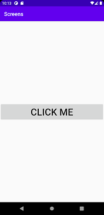
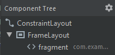

# Rapport

##### 1 - Activities

Creating a second activity was done through right-clicking the app-folder, clicking New -> Activity -> Empty activity.
This results in the creation of an activity that resembles the first main activity.

```
public class MainActivity2 extends AppCompatActivity {

    @Override
    protected void onCreate(Bundle savedInstanceState) {
        super.onCreate(savedInstanceState);
        setContentView(R.layout.activity_main2);
    }
}
```

One can navigate to the second activity through the click of a button.




##### 2 - Fragment

In the second activity I placed a fragment which will contain a future element.



This fragment has a similar structure of code to an activity but with some variation to their functionality.
While they're still able to be utilized in a similar manner, the approach to certain things differs.
For example, when I wanted to load a url I were unable to do so unless I utilized the following code.

```
    public void onViewCreated(View view, Bundle savedInstanceState) {
        super.onViewCreated(view, savedInstanceState);
        WebView my_WebView = view.findViewById(R.id.webview_gif);
        my_WebView.loadUrl("file:///android_asset/hello.gif"); // presents gif
    }
```

I believe there are other ways to display what I strove to display, but this worked for me.
An alternative to displaying the gif through this could be to display an internal html with the gif as an element.

Something I wanted to do was to overlay a string on top of the gif where I greeted the person.
This would be done through a textinput above the button and the value of the id would be brought to the fragment where the presented text would be modified per input.

You are then greeted by the following gif


**Skriv din rapport här!**

_Du kan ta bort all text som finns sedan tidigare_.

## Följande grundsyn gäller dugga-svar:

- Ett kortfattat svar är att föredra. Svar som är längre än en sida text (skärmdumpar och programkod exkluderat) är onödigt långt.
- Svaret skall ha minst en snutt programkod.
- Svaret skall inkludera en kort övergripande förklarande text som redogör för vad respektive snutt programkod gör eller som svarar på annan teorifråga.
- Svaret skall ha minst en skärmdump. Skärmdumpar skall illustrera exekvering av relevant programkod. Eventuell text i skärmdumpar måste vara läsbar.
- I de fall detta efterfrågas, dela upp delar av ditt svar i för- och nackdelar. Dina för- respektive nackdelar skall vara i form av punktlistor med kortare stycken (3-4 meningar).

Programkod ska se ut som exemplet nedan. Koden måste vara korrekt indenterad då den blir lättare att läsa vilket gör det lättare att hitta syntaktiska fel.

```
function errorCallback(error) {
    switch(error.code) {
        case error.PERMISSION_DENIED:
            // Geolocation API stöds inte, gör något
            break;
        case error.POSITION_UNAVAILABLE:
            // Misslyckat positionsanrop, gör något
            break;
        case error.UNKNOWN_ERROR:
            // Okänt fel, gör något
            break;
    }
}
```

Bilder läggs i samma mapp som markdown-filen.


Läs gärna:

- Boulos, M.N.K., Warren, J., Gong, J. & Yue, P. (2010) Web GIS in practice VIII: HTML5 and the canvas element for interactive online mapping. International journal of health geographics 9, 14. Shin, Y. &
- Wunsche, B.C. (2013) A smartphone-based golf simulation exercise game for supporting arthritis patients. 2013 28th International Conference of Image and Vision Computing New Zealand (IVCNZ), IEEE, pp. 459–464.
- Wohlin, C., Runeson, P., Höst, M., Ohlsson, M.C., Regnell, B., Wesslén, A. (2012) Experimentation in Software Engineering, Berlin, Heidelberg: Springer Berlin Heidelberg.
